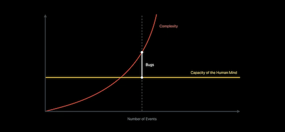

## iOS 端的四层 MVC


想过吗，iOS 端有四层 MVC！它们分别是：

- 第一层：**CALayer**+**UIView**+**？**

在《iOS Core Animation: Advanced Techniques》中作者提到 CALayer 和 UIView 是微型 MVC：*CALayer is a visual class that you would normally associate with the user interface (aka view) part of the MVC (Model-View-Controller) pattern, but in the context of the user interface itself, CALayer behaves more like a model for how the view is going to look when all animations have completed*。

- 第二层：**UIView**+**UIViewController**+**？**

最常见的一层。

- 第三层：**content**+**container**+**？**

看看苹果是怎么介绍 content 和 container UIViewController 的：*Unlike a content view controller that displays your app’s data, a container view controller displays other view controllers, arranging them onscreen and handling navigation between them*。通过 content 和 container 确立了管理和被管理的职责。

- 第四层：**前端**+**后端**+**？**

前端（View）展示后端（Controller）的数据（Model）。

第一层完成绘制交互分离，第二层将模块划分成三部分，第三层组合不同模块，第四层实现前后端分离。就像 TCP/IP 协议一样，每一层都基于上一层、每一层都聚焦于一个关注点。之所以每一层都是一个 MVC，是因为前端的职责是展示数据，Model 代表数据，View 负责展示，而 Controller 作为两者的桥梁。

为什么要有这么多层？大脑的认知有极限，当事物的复杂度超出大脑认知的极限时，就会产生 Bug。将事物化整为零再各个击破，关注点分离（Separation of concerns，SOC）是对抗复杂度最直接、最有效的方法。




## MVC-Coordinator


```swift
extension ViewController {

    @IBAction func buttonTapped(_ sender: UIButton) {
        let anotherVC = AnotherViewController(...)
        navigationController?.pushViewController(anotherVC, animated: true)
    }
}
```

ViewController 和 AnotherViewController 都是 navigationController 的 child，但前者却依赖后者。

```swift
extension ViewController {

    @IBAction func buttonTapped(_ sender: UIButton) {
        coordinator?.showAnother()
    }
}
```

Coordinator 将 Controller 间的逻辑从 Controller 中抽离，从而实现 Controller 间的解耦。

由谁来实现 Coordinator 协议呢？第三层 MVC 告诉我们，container 管理 content UIViewController，由 ViewController 和 AnotherViewController 的 container：navigationController 实现 Coordinator 协议最合适！


## iOS 项目模块化的最佳实践


常见的 iOS 项目由一个 Project 组成，如果使用 Cocoapods 管理依赖，它会创建一个同名 workspace 和一个名为 Pods 的 Project。但 Xcode 的用法不止如此。

我以第三层 MVC 为基础，每个 Project 只包含一个模块。这是 Demo 的结构，每个 Presenter 代表一个模块的入口：

```
RootPresenter: UITabBarController
 ├─ HomePresenter
 ├─ MarketsPresenter
 ├─ TradeNavigationPresenter: UINavigationController
 │   ├─ TradePagePresenter: UIPageViewController
 │   │   ├─ SpotPresenter
 │   │   ├─ ConvertPresenter: UIViewController
 │   │   │   ├─ ConvertViewController
 │   │   │   └─ ConvertOrderPresenter: UIViewController
 │   │   │       ├─ ConvertOrderTableViewController
 │   │   │       └─ ConvertOrderViewController
 │   │   └─ MarginPresenter
 │   └─ FiatPresenter
 ├─ FuturesPresenter
 └─ WalletsPresenter
```

之所以说这个 Demo 是最佳实践，是因为它首先具有随着业务增长不断调整的能力。一开始 Convert 只是 Trade 的一个节点，随着它的规模逐渐变大，我将它从 Trade 中抽出来作为一个独立的 Project。其次相对于单 Project 的项目，它有多个配置文件，这意味着更少的代码合并冲突。除此之外，必须是 `public` 或 `open` 才跨 Project 可见，大大降低了代码的耦合性，增强了内聚性。清晰的边界还意味着易于 Mock，易于调试和测试。

只需要创建一个以根 Presenter 作为 window 的 rootViewController 的 Target，一个 Project 就可以作为一个 App 独立运行！想象一下这样的开发流程：先在 Convert Project 中开发，通过 Convert.App 调试，完成后再接入 Trade.App，最后接入 App。调整一个字体或颜色不需要全局编译就可以快速调试！

为了兼容 CocoaPods，我只需要在 Podfile 中加一行 `workspace 'App'`。

带来的其他优点有：需要的约束少，对代码的侵入性低，最大程度地保留了可能性。一个 Project 用 Objective-C 另一个用 Swift，可以！一个用 UIKit 另一个用 SwiftUI，可以！原本 Model 由 content 持有，在一些情况下会造成额外的网络请求或为了延长 Model 的生命周期使用单例，现在可以把这类 Model 放在 container 中。还有全埋点，DeepLink，以及待挖掘的潜力！

